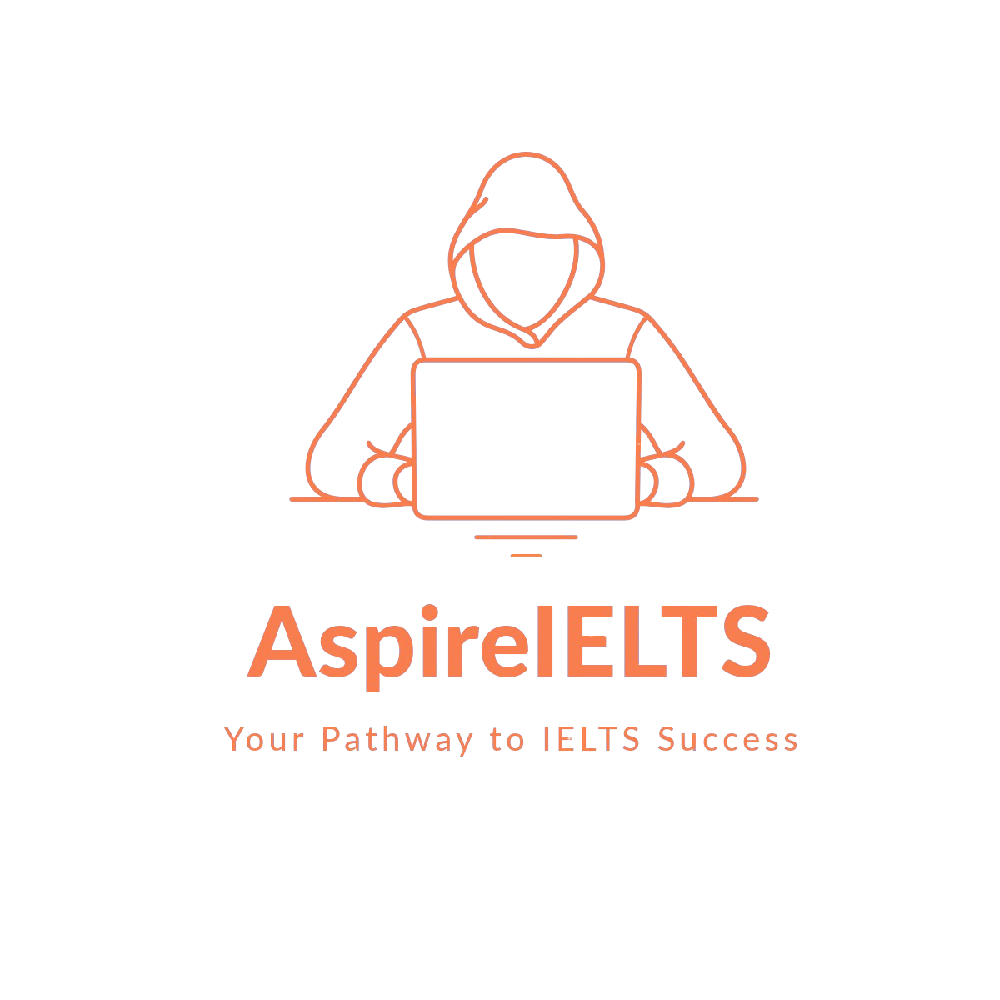

<p align="center">
  
</p>

<h1 align="center">AspireIELTS</h1>

<p align="center">
  Your pathway to IELTS success — learn, practise, take mock tests, and track your progress in one platform.
</p>

<p align="center">
  
  
  
  
</p>

## About

AspireIELTS is a full-stack IELTS preparation and assessment platform built with PHP and MySQL. It brings together section-specific lessons, video courses, timed mock tests, automatic scoring, AI-assisted writing feedback, live speaking assessments, performance analytics, certificates, and student-support services.

The application supports all four IELTS skills: **Listening, Reading, Writing, and Speaking**. Students receive a personal dashboard for tracking their band scores, while administrators can review users, test attempts, speaking sessions, reports, certificate requests, and offer-letter applications.

## Features

### Learning and preparation

- Dedicated preparation areas for Listening, Reading, Writing, and Speaking
- Section-specific tips and test-taking strategies
- Database-driven lecture-video playlists
- Responsive course pages with built-in video playback
- IELTS guidance through an integrated chatbot
- Light and dark interface modes

### Mock assessments

- Three progressive test sets for Listening, Reading, and Writing
- 30-minute Listening tests with audio playback and automatic submission
- 60-minute Reading tests with passages, sections, and automatic submission
- 60-minute Writing tests with letter and essay tasks
- Confirmation screens before each assessment begins
- Automatic answer checking for Listening and Reading
- IELTS-style band-score calculation
- Stored responses, scores, attempt history, and feedback

### AI-assisted feedback

- Writing evaluation through OpenRouter using a configurable DeepSeek model
- Feedback based on task response, coherence and cohesion, lexical resource, and grammatical range and accuracy
- Optional OpenAI-powered chatbot endpoint
- API credentials read from environment variables rather than source code

### Speaking assessment

- Live student–examiner sessions through the Jitsi Meet External API
- A unique meeting room based on the student account
- Active-session monitoring for administrators
- Examiner-entered scores and written feedback
- Speaking results included in the student's overall performance history

### Student dashboard

- Total tests, average band, best score, and lowest score
- Performance levels based on the student's current average
- Recent-test history
- Score trends and test-distribution charts powered by Chart.js
- Direct access to courses and mock tests
- Certificate eligibility when the overall average reaches Band 6.0

### Certificates and application support

- Certificate-request form for eligible students
- PDF certificate generation using FPDF
- Administrator review of certificate requests
- University offer-letter application form
- Upload support for academic, identity, and application documents
- Administrator review of submitted application details and documents

### Administration

- Separate administrator authentication
- Registered-user directory
- Per-user test, result, and response inspection
- Performance reports and charts
- Live speaking-session monitoring and examiner access
- Manual speaking evaluation
- Certificate-request management
- Offer-letter request management

## Technology stack

| Area | Technology |
| --- | --- |
| Backend | PHP and MySQLi |
| Database | MySQL / MariaDB |
| Frontend | HTML, CSS, and JavaScript |
| Authentication | PHP sessions, `password_hash()`, and `password_verify()` |
| Charts | Chart.js |
| AI writing evaluation | OpenRouter API with a configurable DeepSeek model |
| AI chatbot | OpenAI Chat Completions API |
| Live speaking | Jitsi Meet External API |
| PDF generation | FPDF and TCPDF |
| Dependency management | Composer |
| Local environment | XAMPP with Apache and MySQL |

## Getting started

### Prerequisites

- XAMPP with Apache and MySQL/MariaDB
- PHP 8.2 or newer
- PHP extensions: `mysqli`, `curl`, and `mbstring`
- Composer
- A modern web browser
- Internet access for AI services, Jitsi Meet, Chart.js, fonts, and CDN-hosted assets
- An OpenRouter API key for AI writing evaluation
- An OpenAI API key only if the optional OpenAI chatbot endpoint is used

### 1. Clone the repository

Clone the project into XAMPP's `htdocs` directory:

```cmd
cd /d C:\xampp\htdocs
git clone https://github.com/tahmidd01/AspireIELTS.git
cd AspireIELTS
```

If you already downloaded the project elsewhere, move or copy it into:

```text
C:\xampp\htdocs\AspireIELTS
```

### 2. Install PHP dependencies

The generated `vendor/` directory is intentionally excluded from Git:

```cmd
composer install
```

If Composer is not available globally, use the bundled Composer archive:

```cmd
php composer.phar install
```

### 3. Start the local server

Open the XAMPP Control Panel and start:

- Apache
- MySQL

### 4. Prepare the database

Create a database named `aspireielts`:

```sql
CREATE DATABASE aspireielts
  CHARACTER SET utf8mb4
  COLLATE utf8mb4_unicode_ci;
```

Database exports are excluded from this repository because the development dump contained real account and assessment data. Import a **sanitized** schema and seed dataset before using the application.

The principal application tables are:

```text
admin
users
questions
reading_passages
listeningaudio
sectionvideos
writingtasks
tests
testresponses
testresults
writingresponses
speaking_sessions
certificate_info
offer_letter_requests
```

The original schema also defines supporting tables for band-score criteria, user progress, speaking prompts, and speaking records. Listening, Reading, Writing, and video-course features require suitable question, passage, task, audio-path, and video-path seed records.

When publishing a database export, include only table structure and non-sensitive learning content. Do not include real accounts, password hashes, test responses, personal documents, or application records.

### 5. Configure the database connection

The primary connection is defined in `db_connection.php`:

```php
$servername = 'localhost';
$username = 'root';
$password = '';
$dbname = 'AspireIELTS';
```

These values match a typical local XAMPP installation. Update them if your MySQL configuration differs.

Some course and offer-letter handlers currently create their own MySQL connection. Keep their credentials and database name consistent with `db_connection.php`. Database-name capitalization is normally ignored on Windows, but should be standardized before deploying to a case-sensitive server.

### 6. Configure AI credentials

Create a `.env` file in the project root:

```env
DEEPSEEK_API_KEY=your_openrouter_api_key
DEEPSEEK_MODEL=deepseek/deepseek-chat:free
OPENAI_API_KEY=your_openai_api_key
```

Only `DEEPSEEK_API_KEY` is required for the AI writing evaluator. `OPENAI_API_KEY` is needed only for `chatbot.php`.

The AI endpoints expect these values in `$_ENV`. Configure them as Apache/PHP environment variables or load the local `.env` file before those endpoints read it. The project includes `vlucas/phpdotenv`; a root-level bootstrap can load it with:

```php
require_once __DIR__ . '/vendor/autoload.php';

$dotenv = Dotenv\Dotenv::createImmutable(__DIR__);
$dotenv->safeLoad();
```

Require that bootstrap from the AI endpoints. Never hard-code or commit an API key. The `.env` file and its variants are already ignored by Git.

### 7. Supply the local media library

The large `Audio/` and `Videos/` directories are excluded from Git. Restore them from your private local copy or update the database to use hosted media URLs.

Listening tests resolve their recordings through `listeningaudio.AudioFilePath`. The existing dataset follows this pattern:

```text
AspireIELTS/
├── Audio/
│   ├── listening_set1.mp3
│   ├── listening_set2.mp3
│   └── listening_set3.mp3
└── Videos/
    └── ... section-specific lecture videos ...
```

Course pages load their video locations from `sectionvideos.video_path` for Listening, Reading, Writing, and Speaking.

### 8. Create runtime upload directories

Generated certificates and offer-letter documents contain personal data and are excluded from Git. Create the folders locally:

```cmd
mkdir certificate
mkdir "Offer Letter"
```

The Apache/PHP process must have permission to write to these directories. In production, store private documents outside the public web root and serve them only through authenticated authorization checks.

### 9. Open the application

Visit:

```text
http://localhost/AspireIELTS/
```

Useful routes:

| Route | Purpose |
| --- | --- |
| `/index.php` | Public landing page |
| `/signup.php` | Student registration |
| `/login.php` | Student login |
| `/dashboard.php` | Student results and analytics |
| `/videos.php` | IELTS course selection |
| `/tests.php` | IELTS mock-test selection |
| `/offerletter.php` | Offer-letter application |
| `/Admin/admin_signup.php` | Initial administrator registration |
| `/Admin/admin_login.php` | Administrator login |
| `/Admin/admin_dashboard.php` | Administration dashboard |

Disable public administrator registration after creating the first trusted administrator.

## Assessment workflow

```text
Student registration and login
             ↓
Tips and section-based video courses
             ↓
Listening / Reading / Writing / Speaking test
             ↓
Automatic, AI-assisted, or examiner evaluation
             ↓
Stored band score, responses, and feedback
             ↓
Dashboard analytics and progress tracking
             ↓
Certificate access at an overall average of Band 6.0+
```

## Project structure

```text
AspireIELTS/
├── Admin/                 # Administrator portal and review workflows
├── Courses/               # Section tips and database-driven video courses
├── Process/               # Earlier/auxiliary assessment handlers
├── Tests/                 # Active mock tests, submissions, and scoring
├── images/                # Branding and interface imagery
├── fpdf/                  # FPDF library and resources
├── tcpdf/                 # TCPDF library and resources
├── Audio/                 # Listening recordings; excluded from Git
├── Videos/                # Lecture videos; excluded from Git
├── certificate/           # Generated certificates; excluded from Git
├── Offer Letter/          # Private uploaded documents; excluded from Git
├── index.php              # Public landing page
├── dashboard.php          # Student performance dashboard
├── tests.php              # Test-selection interface
├── videos.php             # Course-selection interface
├── cert.php               # Certificate request and PDF generation
├── offerletter.php        # Offer-letter application form
├── chatbot.php            # Optional OpenAI chatbot endpoint
├── db_connection.php      # Primary database connection
├── composer.json          # PHP dependencies
└── .gitignore             # Secret, media, database, and runtime exclusions
```

## Security and privacy

AspireIELTS handles user accounts, assessment results, identity documents, academic certificates, and other sensitive application data. Before any public deployment:

- Keep API keys, `.env` files, and production database credentials out of Git.
- Revoke and rotate any credential that has ever appeared in source control.
- Move uploaded identity and academic documents outside the public web root.
- Validate uploads by MIME type, extension, size, content, and generated filename.
- Require administrator authorization before viewing or downloading documents.
- Add CSRF protection to every state-changing form.
- Validate and constrain all user input, including identifiers passed in URLs.
- Use prepared statements consistently for every database query.
- Disable public administrator signup after initial setup.
- Configure secure session cookies and HTTPS in production.
- Replace detailed production error output with private server-side logging.
- Keep database backups encrypted and access-controlled.

## Development notes

- `Tests/` contains application assessment pages; it is not an automated unit-test suite.
- Audio, video, generated PDFs, uploaded documents, environment files, and SQL dumps are intentionally absent from the repository.
- The complete learning experience requires the excluded media and a populated database.
- Several pages depend on internet-hosted services or assets and will have reduced functionality offline.
- The project is currently optimized for local Windows/XAMPP use. Review filename and database-table capitalization before Linux deployment.

## Disclaimer

AspireIELTS is an independent educational project. It is not affiliated with, approved by, or endorsed by IELTS, the British Council, IDP, Cambridge University Press & Assessment, OpenAI, OpenRouter, Jitsi, or any other referenced service. Practice scores and AI-generated feedback are educational estimates and are not official IELTS results.

## Contributing

1. Fork the repository.
2. Create a feature branch: `git checkout -b feature/your-feature`.
3. Commit your changes: `git commit -m "Add your feature"`.
4. Push the branch: `git push origin feature/your-feature`.
5. Open a pull request.

## License

No project-level license is currently included. Add a `LICENSE` file before granting permission to copy, modify, or redistribute the project. Third-party components remain subject to their respective licenses.
